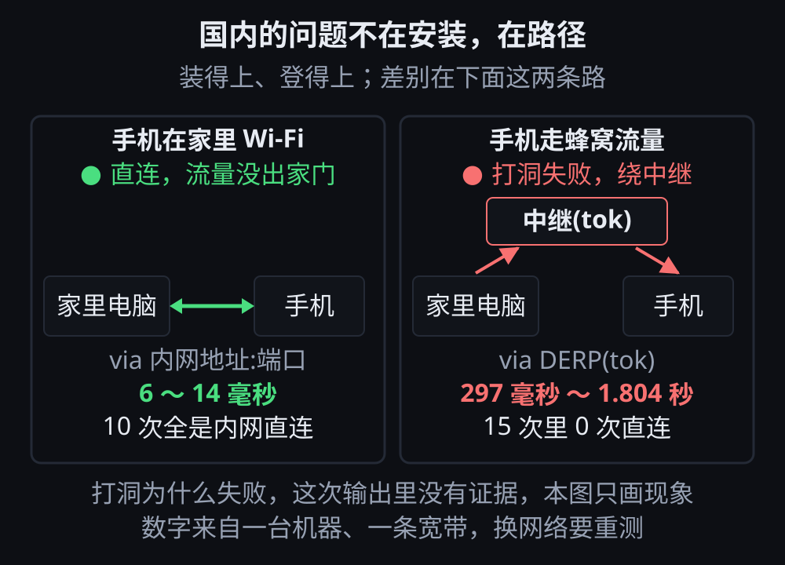

# 第 2 章 · 出门就连不上：国内用 Tailscale 真正卡在哪

> © 2026 xiaomijituan · 正文 CC BY 4.0，代码与数据 MIT · 原仓库 https://github.com/xiaomijituan/agent-machine-room-handbook

**先给一句能动手的话**：装完 Tailscale，先跑 `tailscale netcheck`，它告诉你这台机器离各个中继站分别有多远。这一章的所有判断都从这条命令出发。

这章讲的是一个具体麻烦：你在家连得好好的，人一出门口，手机上的连接就变卡、变得时好时坏。

先说明一件事：网上说"国内装不上 Tailscale"。**我们在自己机器上量过，这句话不成立。** 装得上、登得上，真正的问题是另一件——下面用数字说。

## 先认识三个词

后面全篇要用，先说清：

- **中继（英文 DERP）**：两台机器连不上彼此的时候，流量走的一个中转站。Tailscale 的中继站架在世界各地，旧金山、东京、香港都有。
- **打洞**：两台机器隔着各自的 路由器，想办法直接建立一条通道。打洞成功，流量就不走中转站。
- **NAT**：多台设备共用一个公网地址的那套机制。家里 路由器 在做这件事，手机流量网络也在做这件事。

**tailnet** 是你那一组互相连着的设备；**控制面** 是 Tailscale 用来发配置、管登录的那批服务器域名。

## 第一步：跑 `tailscale netcheck`，逐行读

```
$ tailscale netcheck
Report:
	* UDP: true
	* IPv4: yes, 203.0.113.9:37271
	* IPv6: no, but OS has support
	* MappingVariesByDestIP: false
	* PortMapping:
	* CaptivePortal: false
	* Nearest DERP: Seattle
	* DERP latency:
		- sea: 170.9ms (Seattle)
		- nue: 171.6ms (Nuremberg)
		- sfo: 173.7ms (San Francisco)
		- lax: 174.2ms (Los Angeles)
```

每一行的意思：

| 输出                           | 说人话                                                                       |
| ------------------------------ | ---------------------------------------------------------------------------- |
| `UDP: true`                    | 这台机器能把 UDP 包发到外网。走直连需要这个                                  |
| `IPv4: yes, 203.0.113.9:37271` | 有公网出口地址（**这里的地址是占位符，真实值已涂掉**）                       |
| `MappingVariesByDestIP: false` | 你这台 路由器 对外映射不挑目标地址。**这是好信号**：不挑目标，打洞更容易成功 |
| `PortMapping:`（空）           | 没探测到 UPnP 或 PCP 这类自动开端口                                          |
| `CaptivePortal: false`         | 不是那种"连上还要在网页上点同意"的网络（机场、酒店常见）                     |
| `Nearest DERP: Seattle`        | 离最近的中继在西雅图                                                         |
| `DERP latency` 那一串          | 到各个中继站的往返耗时                                                       |

**看一眼就够用的判断法**：`Nearest DERP` 是不是在境外。我们这台机器两次跑出来的 `Nearest DERP` 分别是旧金山和西雅图，都在境外。**"离中继站 150 毫秒以上"就是这一章所有麻烦的来源。**

我们这台机器跑了两次，两次结果不一样：

```
第一次：Nearest DERP: San Francisco   sfo: 156.4ms   hkg: 252.1ms   tok: 215.6ms
第二次：Nearest DERP: Seattle         sea: 170.9ms   sfo: 173.7ms   lax: 174.2ms
```

**所以别把这个数字当测量结果，它是网络状态的快照，会变。** 另外注意一次测量里出现过的一个现象：**香港的中继比旧金山还慢（252 毫秒对 156 毫秒）**。这一条我们也只看到一次，不解释原因。

## 第二步：登不登得上，量一下再说

有人装之前先挂代理，理由是"控制面被墙"。我们直连量了一次，又挂上本机代理量了一次：

```
直连：
https://api.tailscale.com          http=302 dns=0.014s total=0.503s
https://login.tailscale.com        http=302 dns=0.009s total=0.502s
https://controlplane.tailscale.com http=302 dns=0.009s total=0.525s

挂本机代理：
https://api.tailscale.com          http=302 total=0.804s
https://login.tailscale.com        http=302 total=0.790s
```

**在这台机器上：直连更快，比挂代理快 0.3 秒左右。** `http=302` 说明服务器响应了（302 是"去登录页"的跳转，正常）。

这条结论有多硬？**只对我们这一条宽带硬。** 换一家运营商、换一座城市，可能要重测——所以书里给的是"先量再决定"这个方法，而不是"你不用挂代理"这个结论。

这一章的关键就一句话：能不能装上不是重点，出了家门走的是哪条路才是。下面这张图要看的是同一对设备的两条路——
手机在家里 Wi-Fi 是 6 到 14 毫秒的内网直连，切到蜂窝流量后 15 次全绕中继、最慢一下 1.804 秒：



## 第三步：真正的坑，一次实验

这一组是本章的核心。同一对设备（家里电脑 + 安卓手机，同一个 tailnet），只改一件事：**手机关掉家里 Wi-Fi，走蜂窝流量。**

### 手机在家里 Wi-Fi 时

```
$ tailscale ping -c 5 100.x.y.z
pong from <phone> (100.x.y.z) via <lan-ip:port> in 14ms

$ tailscale ping -c 5 100.x.y.z   （另一次）
pong from <phone> (100.x.y.z) via <lan-ip:port> in 6ms
```

`via` 后面跟的是一个**内网地址加端口号**——意思是：流量在你家 路由器 里面直接走，没出家门。**6 到 14 毫秒。**

### 手机走蜂窝流量时

```
$ tailscale ping -c 5 100.x.y.z
pong from <phone> (100.x.y.z) via DERP(tok) in 320ms
pong from <phone> (100.x.y.z) via DERP(tok) in 371ms
pong from <phone> (100.x.y.z) via DERP(tok) in 310ms
pong from <phone> (100.x.y.z) via DERP(tok) in 329ms
pong from <phone> (100.x.y.z) via DERP(tok) in 316ms
direct connection not established
```

`via DERP(tok)` 的意思是：**打洞没成功，流量改走代号为 `tok` 的中继站。** 最后那句 `direct connection not established` 是命令自己说的"直连没打通"。代号 `tok` 是哪座城市，命令输出里没写，本章不猜。

我们复测了三次，每次 5 下：

| 手机在哪           | 走中继 | 走直连            | 往返耗时                 |
| ------------------ | ------ | ----------------- | ------------------------ |
| 家里 Wi-Fi         | 0      | 10 次全是内网直连 | 6 ～ 14 毫秒             |
| 蜂窝流量（第一次） | 5      | 0                 | 310 ～ 371 毫秒          |
| 蜂窝流量（第二次） | 5      | 0                 | 315 ～ 447 毫秒          |
| 蜂窝流量（第三次） | 5      | 0                 | **297 毫秒 ～ 1.804 秒** |

**15 次里 0 次直连，最慢一下 1.8 秒。**

**这就是"出门就连不上"的真相**：不是连不上，是**每条数据包都要绕到那台中继去再回来**，而且耗时抖动很大——同一个网络里，上一 300 毫秒、下一 1.8 秒。

对写代码的人来说，1.8 秒意味着什么：你在手机上敲一条命令要等回显、你打开远程机器上一个带很多小请求的网页、你让 AI 在远程机器上干活而你在手机上盯着输出——**这三件事都会变得难受，而且难受得没有规律。**

### 这一组实验没证明的事

**为什么打洞失败？** 蜂窝网络通常做了运营商级 NAT，那种情况下打洞难是公认常识。**但这次的输出里没有运营商级 NAT 的直接证据**，所以这一章只报现象：手机走蜂窝流量就打洞失败、改走中继；不写原因。

## 怎么知道你俩之间走的是哪条路

一条命令：`tailscale ping <对端的 tailnet 地址>`。**看 `via` 后面跟的是什么**：

| `via` 后面是                    | 含义                 | 快慢预期               |
| ------------------------------- | -------------------- | ---------------------- |
| `192.168.x.x:数字` 这类内网地址 | 同一个局域网里直连   | 毫秒级                 |
| `公网地址:端口`                 | 打洞成功，跨网络直连 | 看两地距离             |
| `DERP(xxx)`                     | 打洞失败，绕中继     | 境外中继就是几百毫秒起 |

注意：`tailscale ping` 走的是 Tailscale 自己的通道，和普通 `ping` 不是一回事。**普通 `ping` 在这套网络里经常测不出真实情况**，别用它下结论。

## 那能怎么办

**有依据的三条：**

1. **能让两台设备在同一个网络里，就别跨网络。** 家里电脑和家庭存储之间，实测走内网直连 6～14 毫秒；手机一走流量就变成几百毫秒。
2. **长任务放在不会变网络的机器上。** 一个要跑四十分钟的活，放在常年开机的家里电脑或云端主机上，人在外面用手机**看结果**，不要让活本身跟着手机链路跑。这条是本章和第 1 章连起来的做法。
3. **先量，再决定要不要挂代理。** `tailscale netcheck` 加 `tailscale ping`，两条命令三十秒，比看帖子猜省事。

**没测到的两条，只说解决什么问题，不给步骤：**

- **自建中继**：把中转站架在自己附近的机器上，绕开境外那几百毫秒。**我们没有搭过，不写步骤。**
- **自建控制面（Headscale）**：连"发配置、管登录"的那套服务器也自己架，不再依赖官方服务。**同样没测。**

这两条我们排在后面的章节，搭起来、量出来，再写。现在写出来就是编。

## 顺手核对一个常见说法

说法："装 Tailscale 必须先挂代理，不然装不上/登不上。"

**在我们这台机器上：控制面三个域名直连全部通，耗时 0.5 秒；挂代理反而 0.8 秒。** 所以"必须先挂代理"这句话，在我们的环境里不成立。

分寸要说清：这是**一台机器、一条宽带**的结论。你那条宽带可能不一样，所以这一章教你 `netcheck` 和直连耗时对比，而不是给你一个"不用挂代理"的保证。

## 你自己怎么验

三条命令，三十秒，量完你就知道自己属于哪种情况：

```bash
tailscale netcheck                  # 1. 离中继多远。Nearest DERP 在境外就是几百毫秒那一档
tailscale status                    # 2. 有哪些设备、在不在线
tailscale ping <对端地址>            # 3. 你俩之间走的是直连还是中继（看 via 后面）
```

第 3 条要特意做两次：**一次两台设备在同一个 Wi-Fi，一次把其中一台切到蜂窝流量。** 两次的差值就是这一章讲的那个坑。

## 带走三句话

1. **国内的问题不在安装，在路径。** 装得上、登得上；一跨网络就容易改走境外中继。
2. **`via` 后面写的东西决定你的手感。** 写地址端口 = 直连；写 `DERP(tok)` = 绕那台中继，几百毫秒起，还会抖到 1.8 秒。
3. **别让长任务依赖会变的那条链路。** 把活放在网络不变的机器上，手机负责看。

---

### 本章的证据

原始输出在 `evidence/tailscale-cn-probe.md`，采集时间、复测次数、涂改了哪几处都在里面。测到了什么、**没测到什么**，写在 `verify.md`。

### 本章的剧本

`scenario.json` 是这一章的可玩剧本：两台设备，其中一部出门了。现在把文件内容粘进模拟器的"剧本库"就能玩（网页里直接点的功能还没做；界面那个"选一个 .json 文件"按钮也能用，只是我们写自动化工具时够不着那个隐藏的文件框）。

`reference.jsonl` 是我们跑出来的那一局，里面有三次决策：**先查走哪条路（而不是先怪运营商）→ 长活放家里电脑 → 给云端那块屏下发一句"先只跑装机那一步"**。你玩出来的那一局导出后跟它并排比，看差别落在哪一步——**这是比对，不是打分**。

### 一条使用提醒

别把模拟器挂在后台标签页。浏览器会给看不见的页面限速，实测三分钟里页面只推进了 6 拍（正常差不多一秒一拍）。
