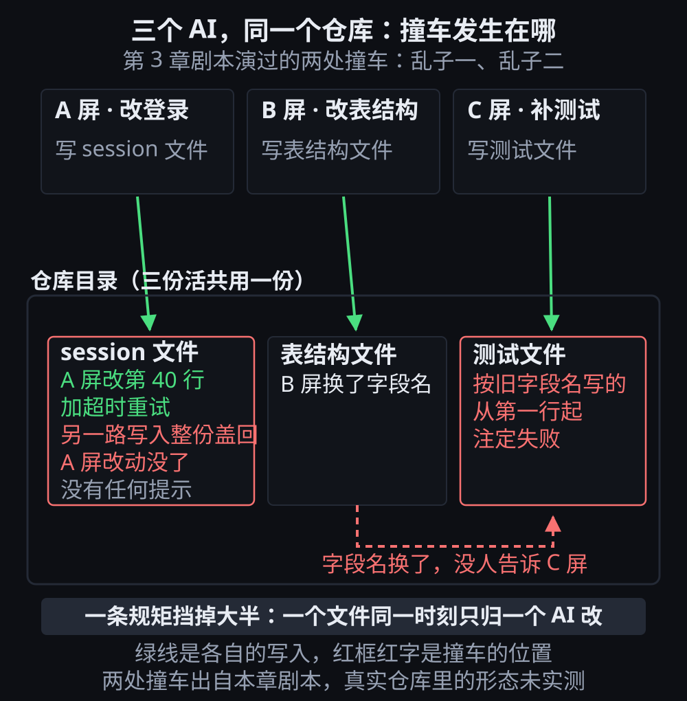

# 第 3 章 · 三个 AI 同时干一个活，会出什么乱子

> © 2026 xiaomijituan · 正文 CC BY 4.0，代码与数据 MIT · 原仓库 https://github.com/xiaomijituan/agent-machine-room-handbook

**先给一句能动手的话**：让三个 AI 同时动同一个仓库之前，先规定一件事——**一个文件同一时刻只归一个 AI 改**。这一章讲为什么这条规矩值得占一句话。

这章只负责让你看见坑，不负责教你填坑（填坑在第 5 章）。

## 那一时刻

你把一件活拆成三份，交给三个 AI：一个改登录、一个改数据库、一个补测试。你把三块屏摆好，去倒水。二十分钟后回来，你会遇到下面五种乱子里的至少两种。

这五种里，**本章的剧本只演前两种**（`edit-login` 那块屏演乱子一，`edit-schema` 那块屏演乱子二）。乱子三有模拟器规则支撑（下一节说明为什么会被接错），乱子四和乱子五是描述出来的常见情形，**没有在剧本里做成卡点**。

## 乱子一：后写的把先写的盖掉

两块屏都改同一个文件。A 屏改了第 40 行，B 屏不知道 A 屏改过，B 屏按它记忆里的版本写回整个文件。**A 屏的改动没了，而且没有任何提示。**

模拟器里这一幕长这样：A 屏报"改了 session 文件的第 40 行，加了超时重试"，接着报"等一下，这个文件现在不是 40 行了"，再报"另一块屏也动过这里，我的改动盖掉了它的改动"。

**为什么会发生**：每个 AI 手里拿的是它开始干活那一刻的文件内容。它写完是把整份内容交回去，不是交"我改了哪几行"。

**当场能做的**：一次只让一个 AI 动一个文件；要动同一个文件，排队。

## 乱子二：等产物的人，等到的是改过的产物

B 屏改完表结构，字段名换了。C 屏此刻正在按**旧字段名**写测试。C 屏不知道字段名换了，它写完的测试从写下的第一行起就注定失败。

**这类乱子的特征是：出错的位置和犯错的决定不在同一个地方。** 测试失败在 C 屏，可真正的改动在 B 屏。你只盯 C 屏排查，会查不出来。

**当场能做的**：谁改了会被别人依赖的东西，先说一声再动。这句话不是客气，是在替别人省一次重跑。

把乱子一和乱子二拼到一张图上，谁在写哪份文件、撞在哪个位置，一眼能对上：

## 乱子三：你给 A 说的话，被 B 接住了

三块屏都在，你打了一行字回车。**接住这句话的是"空闲或已完成"的屏里被选中的那一个**，不一定是你想给的那一个。

模拟器的规则很直白：只有空闲或已完成的屏能接新活，正在跑的屏接不了。所以你以为在跟 A 说话，其实 A 正在忙，这句话落到了旁边的 B 上。

**这个乱子最难发现**，因为屏幕上不会写着"你的话被错的人接了"。

**当场能做的**：派完活立刻看一眼那块屏的任务名有没有变。变错了就重来，别指望它会自己纠正。

## 乱子四：三个都报"完成"，没人知道整件事到哪了

每个 AI 只知道手上那份活。三份都说做完了，可这三份合起来是不是你想要的那件事，**没有任何一个 AI 知道**。

**当场能做的**：整件事的进度只有你管。三块屏之上的那层判断不能外包。

## 乱子五：切了三块屏，回来已经不记得哪块在干什么

这条最土，也最常见。你切过去、切回来、再看别的，二十分钟后你手里有三块屏和三个"进行中"，但你说不出哪块对应哪件事。

**第 1 章讲的会话命名就是为这个准备的**：一块屏一个名字，名字里写清楚是谁的活。

## 国内会多出来的那一层麻烦：取包慢

前五种乱子跟网络无关，在模拟器里演得出来。国内多出来的是这一条：

三个 AI 各自要装依赖，就是几百个请求往同一个源发。**我们量过一次**：同一个包，官方源串行三次是 2.01 / 1.05 / 0.94 秒，并发三次是 0.96 / 1.29 / 2.55 秒；国内镜像串行 0.047～0.081 秒，并发 0.073～0.081 秒。

**这两组数字说明什么**：

- **慢的是官方源本身，不是"抢出口"**。并发时最长 2.55 秒，可串行时最长也有 2.01 秒——这点差落在单次抖动里，**算不出"三个请求互相拖慢"这个结论**。我一开始猜的是"三个 AI 会挤同一个出口"，实测没测出来，所以那句话不写。
- **镜像比官方源快一个数量级，而且稳**。这是本章唯一能给的操作性建议：装依赖前先确认源指向哪。

原始输出在 `evidence/registry-fetch-timing.md`，里面还写清了这次测的局限：**只测了一个很小的文件、一次会话、一台机器。** 真装一次依赖是几百个请求几十兆，结论可能不一样。

## 你自己怎么验

模拟器里玩这一章的剧本（`scenario.json`），五个乱子里挑两个故意踩：

1. 让两块屏同时动同一个文件，看第 40 行那次报告怎么出现。
2. 派活的时候故意派给正在忙的那块屏，看这句话被谁接住。

跑完导出记录，跟书里那份 `reference.jsonl` 并排比，看第一个差别落在第几步。**是比对，不是打分。**

## 带走三句话

1. **一个文件，同一时刻只归一个 AI。** 这条能挡掉乱子一和乱子二的大半。
2. **改了别人依赖的东西，先说一声。** 这句话省的是别人的重跑。
3. **三份"完成"不等于一件事完成。** 上面那层判断不能外包。

---

### 本章的证据与记录

`verify.md` 写了哪些是模拟器里演过的、哪些是本机量过的、哪些**没测到**。原始输出在 `evidence/`。

### 一句提醒

别把模拟器挂在后台标签页——浏览器会限速看不见的页面，我们实测三分钟只推进了 6 拍。
