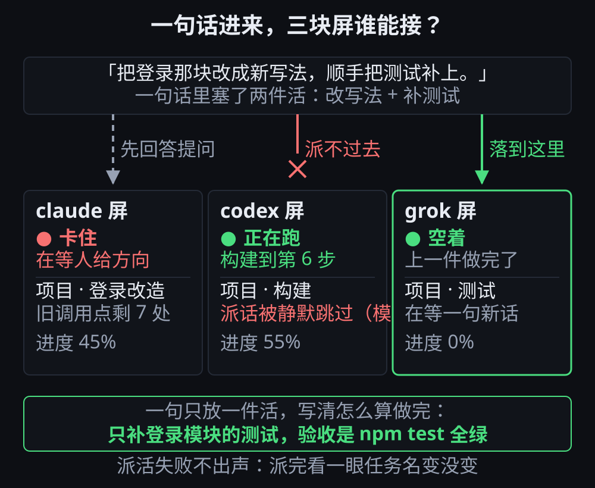

# 第 5 章 · 三块屏都停着，你只有一句话

> © 2026 xiaomijituan · 正文 CC BY 4.0，代码与数据 MIT · 原仓库 https://github.com/xiaomijituan/agent-machine-room-handbook

**先给一句能动手的话**：派活之前先看清每块屏的状态——**只有空闲或已完成的屏能接新活**；正在跑的屏你说什么它都接不住。

第 3 章让你看见乱子，这一章讲的是同一批乱子的解法里最常用的一条：话要给对的人。

## 那一时刻

三块屏：一块卡住在等你给方向，一块正在跑构建到第 6 步，一块空着。

你手上有**一句话**：「把登录那块改成新写法，顺手把测试补上。」

你现在要决定两件事：**这句话给谁**，以及**这句话要不要拆开**。

这一章的关键就一句话：派活之前先看哪块屏接得住。下面这张图要看的是三条去路的差别——卡住的屏先回答提问，
正在跑的屏会把派过去的话静默跳过（模拟器规则），只有空着的那块屏落得下去：



## 三条判断

### 一、谁能接

模拟器里的规则很硬，也正好是真实工具的写照：

- **空闲的屏**能接，优先给空闲的。
- **已完成的屏**能接，但排在空闲的后面。
- **正在跑的屏接不了**。一块都接不了的时候，派活这件事会被拒绝。

所以"我刚才明明说了，为什么没动"最常见的原因不是 AI 偷懒，而是**你把话给了一块正在忙的屏**，或者当时没有任何一块屏在可接活的状态。

**派完一定要看一眼**：那块屏的任务名变了吗？没变就是没接住。别指望它会自己纠正。

**这不是猜测，我们试过。** 在模拟器里回答完一块屏、又把第一句派给空着的那块之后，三块屏都在跑了。这时候再发第二句话："顺手把 CI 配置也改了"。结果是：**事件数一条没多，三块屏的任务名一个没变**——第二句话被静默吞掉了，没有报错、没有"被拒绝"那一行。

所以那句话要改成更硬的一条：**派活失败是不出声的。唯一的看板就是任务名。**

### 二、一句只放一件活

「改登录，顺手把测试补上」是两件事。真实情况里，AI 大概率只做第一件，然后把第二件当成你说的顺口话忘掉。

**依据要说清**：这一条是经验，**我们没做成实验**（`verify.md` 里记着）。但它的成本极低——拆成两句，不拆最多损失一次重派。

拆完还有一层好处：第一件做完你能验收（第 4 章那三件套），再派第二件。一句塞两件，中间没有任何你可以插进去检查的位置。

### 三、派完就走，别守着

这一点回到第 1 章：**屏是给 AI 干活用的，不是给你盯着看的**。你守着只会让自己以为进度取决于你有多专注。

派完之后，那块屏上正在发生什么，你导出记录就能看见每一步之前问了什么、你选了什么、之后走到了哪。守着看，反而看不见。

## 派活那句话怎么写

一句能抄的话：

```
只改 <范围>，不要动 <别的地方>。
做完给我：改了哪些文件、跑了哪条命令、那条命令的完整输出。
跑不通就停下来告诉我卡在哪，不要顺手改别的。
```

**为什么有第三行**：AI 卡住时最爱干的事是"绕过去"——把检查注释掉、把测试跳过。你如果不明说，绕过去的结果也会报"完成"。

**为什么有"不要动别的地方"**：这是第 3 章乱子一和乱子二的预防。范围收紧，两块屏撞上的机会就小。

## 三块屏都卡住了，先后顺序

三块屏都在等人给方向时，按这个顺序给：

1. **先给挡住了别人的那一块**。它在关键路径上，别的屏在等它的产物（第 3 章乱子二）。
2. **再给能立刻接住的空闲屏**，让它先跑起来——活是并行推进的，空着最浪费。
3. **最后处理孤零零那块**：只影响它自己，不会拖累别人。

判断"谁挡住了别人"的方法很土：**问每块屏"你在等什么"**。模拟器里等产物的那块屏会直接说"我在等另一块屏的结果"。

## 你自己怎么验

玩本章剧本（`scenario.json`）：三块屏三种状态，一句话在手。三个卡点依次是"这句话给谁""要不要拆""派活那句话怎么写"。

**故意试一次把话派给正在忙的那块屏**，看它接不住、任务名不变——这就是"我说了为什么没动"的那一幕。

跑完导出记录跟 `reference.jsonl` 并排比。**是比对，不是打分。**

---

### 本章的证据与记录

哪几条是模拟器规则支撑的、哪几条只是经验，全写在 `verify.md` 那张表里。

### 一句提醒

别把模拟器挂在后台标签页——浏览器会限速看不见的页面，实测三分钟只推进 6 拍。
