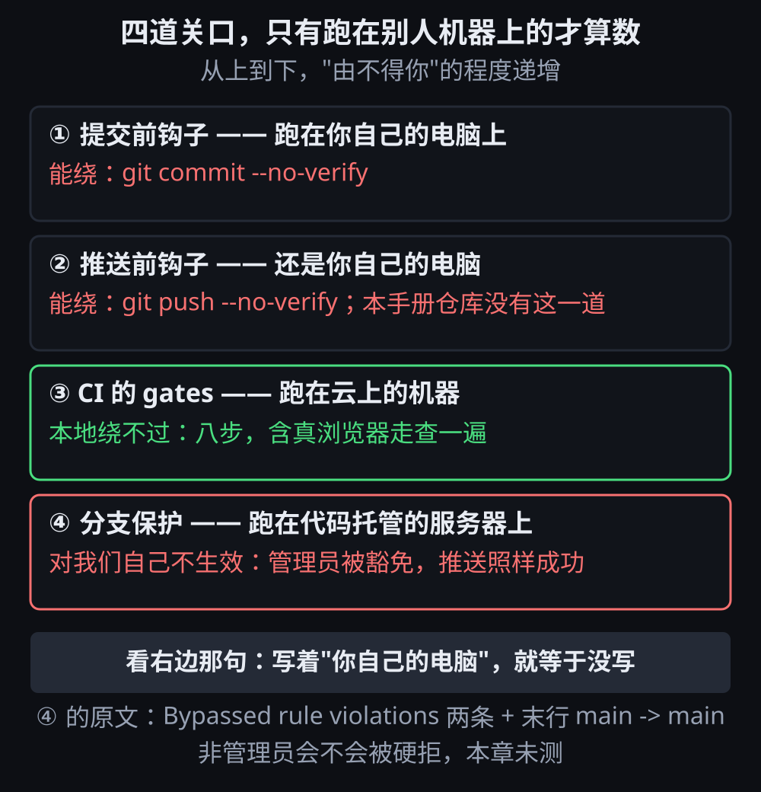

# 第 8 章 · 你说做完了不算，四道关口替我问一遍

© 2026 xiaomijituan · 正文 CC BY 4.0，代码与数据 MIT · 原仓库 https://github.com/xiaomijituan/agent-machine-room-handbook

> 第 4 章教的是**人**怎么向 AI 要证据。这一章把同一件事交给**机器**：四道关口，
> 一道比一道不由着你——最后一道甚至不在你的电脑上。
> 但这一章也会说清最后一道在我们自己仓库里**没有生效**，以及为什么还留着。

## 先说清楚"关口"是什么

**关口（门禁）**：一条命令，跑不过就不让下一步发生。**钩子（hook）**：Git 在提交或推送之前
自动替你跑的那条命令，写在 `.husky/` 这类目录里。下面按"跑在哪台机器上"排，越靠后越不由你：

| 第几道 | 什么时候跑             | 跑在哪台机器上   | 我们仓库里实际跑的命令                                                                    | 绕得过去吗                       |
| ------ | ---------------------- | ---------------- | ----------------------------------------------------------------------------------------- | -------------------------------- |
| 一     | `git commit` 之前      | 你自己的电脑     | 手册仓库：`npm run check` 加 `npx prettier --check .`；聚变仓库：`npx prettier --check .` | 绕得过：`git commit --no-verify` |
| 二     | `git push` 之前        | 你自己的电脑     | 聚变仓库：`npm run typecheck && npm run lint && npm run test`；**手册仓库没有这一道**     | 绕得过：`git push --no-verify`   |
| 三     | 推上去之后             | 云上的 CI 机器   | 类型、静态检查、测试、构建、剧本校验、真浏览器走查，最后再拿发布产物跑一遍                | 本地绕不过，但只拦"已经推上去的" |
| 四     | 服务器收到推送的那一刻 | 代码托管的服务器 | 分支保护：改 `main` 必须走拉取请求、CI 必须绿、禁止强推                                   | 见下面"没守住的那一下"           |

**拉取请求（PR）**：把"我想把这些提交合进 `main`"当成一个请求发出去，别人（和 CI）点头才合。
**强推（force push）**：用 `--force` 让远端的历史按你本地的覆盖，是撤销别人工作的最快办法。

这一章的关键就一句话：关口越多越好是错觉，**只有跑在别人机器上的那几道才算数**。下面这张图要
看的是每道关口右边那一栏——前两道写着"你自己的电脑"，那就等于没写。



## 第一道和第二道：都在你自己机器上，所以都绕得过

两个仓库的钩子内容不一样，照抄下来：

```
# 聚变（多 agent 模拟器）仓库
.husky/pre-commit:  npx prettier --ignore-unknown --check .
.husky/pre-push:    npm run typecheck && npm run lint && npm run test

# 本手册仓库
.husky/pre-commit:  npm run check
                    npx prettier --check .
.husky/pre-push:    （没有这一道）
```

手册仓库把内容检查放在提交前、把格式化也放在提交前，**没有推送前那道**。理由写在提交历史里：
内容检查查的是这一章五件文件齐不齐、掩码漏没漏，那些东西跟格式化一样属于"提交前就该干净"。

`--no-verify` 是 Git 自带的跳过开关，一条命令就把前两道废掉。这一章**没有实测过真的用它绕过**，
那是 Git 的公开行为，写在这里只为了说清一件事：**前两道不是防线，是提醒**。

### 一个真实事故：钩子查的是你交上去的那份，不是你打算改的那份

`git add` 之后又改了同一个文件，提交进去的是**暂存区里那份旧文本**——钩子跑的是暂存内容，
所以它绿得很诚实。这一条撞过一次：说明文字先 `add` 了，随后又改了一句，提交上去的是改之前那句，
只能再补一个提交。教训不是"钩子不可信"，而是**钩子不知道你以为你改了什么**。
所以推送前那一道（跑在暂存之后）和 CI 那一道（跑在服务器上、看的是最终推上去的提交）不是重复劳动。

## 第三道：CI 的 `gates` 作业

两个仓库的 CI 作业都叫 `gates`。聚变仓库那份跑八步，抄下来：

```
npm ci → typecheck → lint → test → build → scenario:check
→ 装一个真浏览器 → 用真浏览器把生产构建点一遍（scripts/ci-qa.mjs）
→ 打出两个发布产物，并拿它们跑一遍
```

最后一步值得单独说，因为它决定这道关口是不是**真的**在检查东西：

```yaml
- name: Bundle the release artifacts and run them like the handbook CI would
  # Last, because the projector is smoked on the .jsonl the walk just downloaded
  # (screenshots/qa-8-run.jsonl) — real app output beats a hand-written fixture.
```

翻译过来：投影器（把运行记录变成复盘表的工具）吃的输入，是**上一步浏览器走查刚刚下载下来的那份
真记录**，不是手写样例。手写样例只会证明"我想到的情况能通过"，真输出才会证明"应用真的产出了
那种形状"。

还有一处反直觉的配置，注释也照抄：

```yaml
jobs:
  gates:
    # 钉死镜像，不用 ubuntu-latest：latest 从 2026-10-19 起从 Ubuntu 24.04 换成 26.04，
    # 而我们脚下的机器不该在没人决定的那天自己换。CI 里的 playwright --with-deps chromium
    # 装的是系统依赖，最容易随镜像变。要跟迁的那一天，单独开一次验证再改这里。
    runs-on: ubuntu-24.04
```

`ubuntu-latest` 是"跟着别人走"，`ubuntu-24.04` 是"我决定的那天"。走查依赖的是浏览器装好的那批
系统包，最容易在换镜像那天出问题。**把"最新"钉死不是保守，是让失败发生在一个有人负责的日子。**

## 第四道：服务端分支保护，以及它没守住的那一下

这一道跑在 GitHub 服务器上，本地任何开关都影响不到它。规则配了三条：改 `main` 必须走拉取请求、
CI 的 `gates` 必须绿、禁止强推与删除 `main`。

然后是一次真实推送的原文输出（2026-10-06，仓库是聚变）：

```
remote: Bypassed rule violations for refs/heads/main:
remote:
remote: - Changes must be made through a pull request.
remote:
remote: - Required status check "gates" is expected.
remote:
To https://github.com/xiaomijituan/fusion.git
   e7b5da3..b15c086  main -> main
```

**看最后一行：`e7b5da3..b15c086  main -> main`——推送成功了。** `Bypassed rule violations` 的意思
不是"违规被拦下"，而是"**这些违规被绕过了**"。绕过的人是管理员，而规则里管理员是豁免的。

所以这一章最该被记住的一条是：**我们配的第四道关口，对我们自己不生效。** 为什么还留着？两个理由，
都写在这里而不是藏在配置里：

1. 单人项目里，它的价值是**留痕**——每次直推都会在推送输出里留下两条违规，等于每次破例都签个名。
2. 一旦有第二个协作者（或者未来的你换了个管理员账号），第二道防线立刻对新人生效，
   不需要临时补课。

**没量到的**：非管理员直推会不会被硬拒。手上没有第二个账号，所以这一条只能标"未测"，
不能拿"配了规则"当成"拦得住"。

## 两个把门禁自己弄坏的真实事故

关口本身也会咬人，这两次都是真发生的：

- **格式化工具改动了必须逐字节一致的文件。** 手册仓库里放着一份从聚变发布页复制来的模拟器
  （叫 `vendor/` 那份），要核对大小和校验和。跑一次 `prettier --write .` 之后，那份文件从
  `404364` 字节变成 `825718` 字节——内容没变，全被重新排版了，校验和对不上。修法是
  `.prettierignore` 里写明"为什么"，而不只是"忽略"。
- **换行符转换让"同一份文件"在两台机器上不是同一串字节。** 这台机器 `core.autocrlf=true`，
  检出时 LF 变 CRLF，于是下载回来的字节和仓库里的字节不一样，MD5 天然对不上。修法是
  `.gitattributes` 对那几类文件写 `-text`（不参与换行符改写），注释里连着原因一起提交。

两条共同教训：**门禁的输入必须是你真正要交出去的东西**。格式化会改输入，换行符转换会改输入，
两者都会让"过了检查"和"实际内容"脱钩。

## 本章没量到的部分

1. `--no-verify` 真绕过前两道：没做过，属于 Git 的公开行为陈述。
2. 非管理员被第四道硬拒：没有第二个账号，未测。
3. 管理员豁免要不要关掉：这是取舍，不是技术——关掉之后每次单人小改动都得开拉取请求等 CI。
   我们选了"留着豁免 + 靠 `Bypassed` 那两行留痕"，**没有对比过另一种配法的实际代价**。

## 本章的三块屏

三块屏分别停在第一道、第三道、第四道关口前。剧本在 [`scenario.json`](./scenario.json)，
一局真跑出来的记录在 [`reference.jsonl`](./reference.jsonl)——这一局的记录是从模拟器的导出按钮
**真的下载落盘**拿到的，跟前七章从浏览器内部存储里读回来的做法不同，证据等级见
[`verify.md`](./verify.md)。国内网络环境下的额外差异见 [`china.md`](./china.md)。
